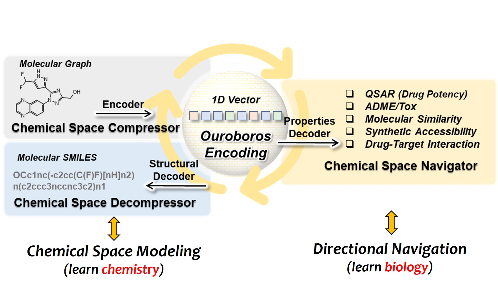

<h1 align="center">  Ouroboros  </h1>
<h3 align="center"> Directed Chemical Evolution via Navigating Molecular Encoding Space </h3>
<p align="center">
  📃 <a href="https://doi.org/10.1101/2025.03.18.643899" target="_blank">Paper</a> ·  🤗 <a href="https://zhanglab.comp.nus.edu.sg/Ouroboros/" target="_blank">Model</a> ·  📕 <a href="https://zhanglab.comp.nus.edu.sg/Ouroboros/" target="_blank">Data</a><br>
</p>

<p align="center">
  
</p>

This repository provides the official implementation of the Ouroboros model and utilities. Ouroboros aims to bridge the gap between representation learning and generative AI models and **facilitate chemical space navigation for directed chemical evolution**. Ouroboros first employs representation learning to encode molecular graphs into **1D vectors**, which are then **decoded independently** into molecular property prediction and molecular structure production. Please also refer to our [paper]() for a detailed description of Ouroboros.     

## 💗 Motivation  

Ouroboros is an unified framework that seamlessly integrates representation learning with molecular generation and therefore **allows efficient chemical space exploration through pre-trained molecular encodings**. By reframing the directed chemical evolution as a process of encoding space compression and decompression, the strategy overcomes the challenges associated with iterative molecular optimization, enabling optimal molecular optimization directly within the encoding space.    

## 💡 Highlight

**Overview:**

* Ouroboros introduces a new protocol to **unify the representative learning and molecular generation**.      
* Ouroboros towards directed chemical evolution in **encoding space**, which was designed to mimic the chemical space.     
* Ouroboros provides a molecular representation that can be flexibly encoded and decoded, **allowing new models built upon it to be easily applied to molecular generation**.     

**Chemical Space Modeling:**

* Ouroboros projects molecules of different sizes and structures into a **1D Vector** and ensures that the similarities of this **1D Vector** are pharmacophore meaningful.     
* Ouroboros' **1D Vector** can be reconstructed to the original chemical structure.     

**Chemical Foundational Model:**

* Ouroboros not only provides **molecule-to-encoding** transformation, but also **encoding-to-molecule** reconstruction.     
* You can practice **directed chemical evolution on any downstream model built on Ouroboros**.      

## 📕 Installation

To set up the Ouroboros model, we recommend using conda for Python environment configuration. If you encounter any problems with the installation, please feel free to post an issue or discussion it.    

<details>
<summary>(←🖱️) Environment Setup</summary>
<br>

> Installing MiniConda (skip if conda was installed)   

``` shell
    wget https://repo.continuum.io/miniconda/Miniconda3-latest-Linux-x86_64.sh
    sh Miniconda3-latest-Linux-x86_64.sh
```

> Creating Ouroboros environment   

``` shell
    conda create -n Ouroboros python=3.9
    conda activate Ouroboros
```

> Setting up Ouroboros PATH and configuration   
 
``` shell
    git clone https://github.com/Wang-Lin-boop/Ouroboros
    cd Ouroboros/
    echo "# Ouroboros" >> ~/.bashrc
    echo "export PATH=\"${PWD}:\${PATH}\"" >> ~/.bashrc # optional, not required in the current version
    echo "export Ouroboros=\"${PWD}\"" >> ~/.bashrc
    source ~/.bashrc
    echo "export ouroboros_app=\"${Ouroboros}/ouroboros\"" >> ~/.bashrc # Ouroboros applications     
    echo "export ouroboros_lib=\"${Ouroboros}/models\"" >> ~/.bashrc # Ouroboros models 
    echo "export ouroboros_dataset=\"${Ouroboros}/datasets\"" >> ~/.bashrc # Ouroboros datasets 
    source ~/.bashrc
```

Before running Ouroboros, you need to install dependency packages.   

```
conda activate Ouroboros

pip install six==1.17.0 tqdm==4.67.1 dill==0.3.9 pyarrow==19.0.0 
pip install pandas==1.5.3 scipy==1.13.1 matplotlib==3.9.4 
pip install numpy==1.23.5 seaborn==0.13.2 scikit-learn==1.6.1 rdkit==2024.9.5 selfies==2.2.0 oddt==0.7

pip install dgl -f https://data.dgl.ai/wheels/torch-2.2/cu121/repo.html
pip install dglgo -f https://data.dgl.ai/wheels/torch-2.2/cu121/repo.html
pip install dgllife

pip install torchtriton --extra-index-url "https://download.pytorch.org/whl/nightly/cu121" # pip install torchtriton --extra-index-url "https://download.pytorch.org/whl/nightly/cu117" , if no matching distribution found.
```

</details>

<details>
<summary>Download datasets and Ouroboros models</summary>
<br>

In this repository, we provide the molecular dataset (`datasets/MolecularDataset.csv`), pre-trained Ouroboros models and useful chemical datasets, you can download the last two via [ZhangLab WebPage](https://zhanglab.comp.nus.edu.sg/Ouroboros/). Then, we need place the models to the `${ouroboros_lib}`, and place the chemical datasets to `${ouroboros_dataset}`. Besides this, benchmark test sets (e.g. DUD-E and LIT-PCBA) are available from the original article, or to get pre-processed data, you can download it from [Zenodo](https://zenodo.org/records/10450788).        

We provide three different versions of the model, all of them trained based on the strategy reported in the paper, with the difference that:    
```
1. M0 was trained and tested strictly according to the methodology section of our paper;      
2. M1c and M1d: training datasets used for their molecular decoders consisting more complex sources and with SMILES (c) and SELFIES (d) as the chemical language.      
```
In this GitHub repository, we update the latest version of the code and models for Ouroboros (they usually have better performance). If your goal is only to reproduce the results in the article, please use the original model and source code provided on [ZhangLab WebPage](https://zhanglab.comp.nus.edu.sg/Ouroboros/), or use the 0.1.0 release of the repository. If the current version does not meet the demands of your drug discovery program, feel free to contact [us](Wanglin1102@outlook.com) to try our in-house version.         

</details>   

## 📓 Application

Ouroboros provides a unified framework that seamlessly integrates representation learning with molecular generation, which allows us to use Ouroboros as a **molecular representation** model to perform ligand-based virtual screening and molecular property modeling, and other uses as a **molecular generation** model to directed chemical evolution.   

<details>
<summary>Virtual Screening</summary>
<br>

In concept, molecules share similar conformational space also share similar biological activities, allowing us to predict the similarity of biological activities between molecules by comparing the similarity of Ouroboros encodings.     

Here, we introduce the ``PharmProfiler.py``, an approach that employs the Ouroboros encoding to establish pharmacological profiles and facilitate the search for molecules with specific properties in chemical space. ``PharmProfiler.py`` offers the capability to conduct ligand-based virtual screening using commercially available compound libraries. Furthermore, it enables target identification through ligand similarity analysis by leveraging comprehensive drug-target relationship databases.    

To support experimentation, we have included a collection of diverse commercial compound libraries and drug-target relationship databases, conveniently located in the `${ouroboros_dataset}/` directory.     

> 1. Prepare the pharmacological profile and compound libraries

To define a pharmacological profile, you will need to input a `profile.csv` file, which should have the following format:   

``` 
SMILES,Label
C=CC(=O)N[C@@H]1CN(c2nc(Nc3cn(C)nc3OC)c3ncn(C)c3n2)C[C@H]1F,1.0
C=CC(=O)Nc1cccc(Nc2nc(Nc3ccc(N4CCN(C(C)=O)CC4)cc3OC)ncc2C(F)(F)F)c1,1.0
C#Cc1cccc(Nc2ncnc3cc(OCCOC)c(OCCOC)cc23)c1,1.0
COC(=O)CCC/N=C1\SCCN1Cc1ccccc1,0.4
C=C(C)[C@@H]1C[C@@H](CC2(CC=C(C)C)C(=O)C(C(CC(=O)O)c3ccccc3)=C3O[C@@H](C)[C@@H](C)C(=O)C3=C2O)C1(C)C,-0.8
C/C(=C\c1ncccc1C)[C@@H]1C[C@@H]2O[C@]2(C)CCC[C@H](C)[C@H](O)[C@@H](C)C(=O)C(C)(C)[C@@H](O)CC(=O)O1,-0.5
```

The "Label" column signifies the weight assigned to the reference compound. Positive values indicate that the selected compounds should bear resemblance to the reference compound, while negative values imply that the selected compounds should be dissimilar to the reference compound. Typically, positive values are assigned to **active** compounds, whereas negative values are assigned to **inactive** compounds or those causing **side effects**.   

```
ID,SMILES,Target
CHEMBL3984086,C[C@@]1(N2CCc3c(-c4cnc(N)nc4)nc(N4CCOCC4)nc32)CCN(S(C)(=O)=O)C1,PI3Ka
CHEMBL1236962,COc1ncc(-c2ccc3nccc(-c4ccnnc4)c3c2)cc1NS(=O)(=O)c1ccc(F)cc1F,PI3Ka
CHEMBL3586672,CCCOCCNC(=O)Nc1nc2c(s1)CN(c1cncc(OC)c1)CC2,PI3Kg
CHEMBL1236962,COc1ncc(-c2ccc3nccc(-c4ccnnc4)c3c2)cc1NS(=O)(=O)c1ccc(F)cc1F,PI3Kg
ALISERTIB,COc1cc(Nc2ncc3c(n2)-c2ccc(Cl)cc2C(c2c(F)cccc2OC)=NC3)ccc1C(=O)[O-],AURKA
AT-9283,O=C(Nc1c[nH]nc1-c1nc2cc(CN3CCOCC3)ccc2[nH]1)NC1CC1,AURKA
ENMD-2076,Cc1cc(Nc2cc(N3CC[NH+](C)CC3)nc(/C=C/c3ccccc3)n2)n[nH]1,AURKA
CHEMBL379975,O=C1NC(=O)c2c1c(-c1ccccc1Cl)cc1[nH]c3ccc(O)cc3c21,WEE1
CHEMBL49120,CC[NH+](CC)CCOc1ccc(Nc2ncc3cc(-c4c(Cl)cccc4Cl)c(=O)n(C)c3n2)cc1,WEE1
```

Besides explicitly specifying weights, we can also **group SMILES by Target**, at which point Ouroboros calculates the similarity of each group separately and weights the sum (default weight is 1, unless you specify an additional weight column).

The compound libraries are also stored in CSV format in the `${ouroboros_dataset}/` directory. It is requried to maintain consistency between the SMILES column name in the `profile.csv` file and the compound library.    

> 2. Perform the PharmProfiler

To perform virtual screening, the following command can be used.   

Here, `profile_set` represents the provided pharmacological profile by the user, `keep_top` indicates the number of compounds to be outputted in the end, and `probe_cluster` determines whether compounds with the same weight should be treated as a cluster. Compounds within the same cluster will be compared individually with the query mol, and the highest similarity score will be taken as the score of query mol.   

We have provided a processed version of the commercial compound library at the `${ouroboros_dataset}/commercial.csv`, which contained 19,116,695 purchasable compounds. To perform target identification, the compound library can be replaced with the `${ouroboros_dataset}/DTIDB.csv`, which contains drug-target relationships. This is a processed version of the BindingDB database, which contains 2,159,221 target-ligand paris.      

``` shell
export ouroboros_model="Ouroboro_M0"
export job_name="Virtual_Screening"
export profile_set="profile.csv" # SMILES (same to compound library) and Label/Target/Weight
export label_col="Target" # weights for profiles
export compound_library="${ouroboros_dataset}/commercial.csv" 
export smiles_column="SMILES" # Specify the column name in the compound_library
export keep_top=1000
export probe_cluster="Yes"
export flooding=0.5
python -u ${ouroboros_app}/PharmProfiler.py "${ouroboros_lib}/${ouroboros_model}" "${job_name}" "${smiles_column}" "${compound_library}" "${profile_set}" "${weight_column}" "${probe_cluster}" "${flooding}" "${keep_top}" 
```

After the initial run of PharmProfiler, a extracted feature database `xxx.pkl` will be generated in `${ouroboros_model}`. Subsequent screening tasks on the same compound library can benefit from PharmProfiler automatically reading the feature file, which helps to accelerate the running speed.    

</details>   

<details>
<summary>Molecular Proptery Modeling</summary>
<br>

> 1. Molecular Property Datasets

Before molecular property modeling, it is crucial to carefully prepare your data, which includes compound structure pre-processing and dataset splitting. Firstly, you need to clarify the chirality and protonation states of molecules in the dataset, which can be done using chemical informatics tools such as RDKit or Schrödinger software package. 

The processed data should be saved in CSV file format, containing at least one column for **`SMILES`** and one column for **`Labels`**. Subsequently, utilize the following command for scaffold partition. By default, 70% of the dataset is used for training (10% of training for validation) and 30% for test.     

``` shell
export smiles_column="SMILES" # Specify the column name in datasets
export label_column="Label" # Specify the column name in datasets
export dataset="${ouroboros_dataset}/data.csv"
export dataset_bp=${dataset##*/}
for method in "skeleton" "CombineFP" "MACCS" "ECFP4:AtomPairs";do # how to define scaffold
export dataset_name=${dataset_bp%%.csv}_${method}
python -u ${ouroboros_app}/utils/advanced_partition.py ${dataset} ${dataset_name} ${smiles_column} ${label_column} 0.3 0.1 "${method}"
done
```

We provide two main approaches for partitioning the dataset, which include skeleton based one and fingerprint clustering based one. Here, `Birch` is default clustering algorithm, you can use `:` splitting to specify multiple molecular fingerprints.    

Please keep your dataset partition safe, it is important to reproduce previous results. Usually, you can save it into the `${ouroboros_dataset}`.    

> 2. Molecular Property Predictive Model

Hyperparameter tuning is important for most molecular property modeling tasks. Here we provide a `PropModeling.py` for molecular property modeling where the hyperparameter settings seem to work well on most tasks. Of course, if further performance improvements are desired, then changing the script to find better hyperparameters is necessary.   

``` shell
export ouroboros_model="Ouroboro_M0"
export dataset_prefix="${ouroboros_dataset}/Your_Dataset/Your_Dataset" # Specify a path and file prefix to your datasets (train, valid, and test)
export smiles_column="SMILES" # Specify the column name in datasets
export label_column="Label" # Specify the column name in datasets
export metric="SPEARMANR" # Specify the validation metric
export job_name=${dataset_prefix##*/}_${ouroboros_model##*/}
python -u ${ouroboros_app}/PropModeling.py ${dataset_prefix} "${ouroboros_models}/${ouroboros_model}" "${smiles_column}" "${label_column}:${metric}" ${dataset_prefix##*/}
```

The model appears under the `${ouroboros_model}/` path at the end of the job run, at which point it is ready to be applied in molecule generation or virtual screening. In the `${ouroboros_dataset}`, we provide four distinct molecular property datasets: *solubility, lipophilicity, Caco-2 membrane permeability*, and *synthetic accessibility*. Ouroboros demonstrates superior modeling performance for these properties, which will serve as the default constraints on molecular properties for chemical evolution. Ideally, this will assist the model in exploring a chemically feasible space with an optimal hydrophilic-lipophilic balance and synthetic accessibility.   


Furthermore, for some small molecular datasets, you can use `PropPredictor.py` to directly predict their molecular properties.    

``` shell
export ouroboros_model="Ouroboro_M0"
export dataset="dataset.csv" # Specify a path to your datasets
export smiles_column="SMILES" # Specify the column name in datasets
python -u ${ouroboros_app}/PropPredictor.py ${ouroboros_model} "${smiles_column}" "${dataset}"
```

This will apply all available molecular property predictors in `${ouroboros_model}` for the `${smiles_column}` of `${dataset}`, resulting in a blanket prediction. If you are a cloud service provider, be aware of potential leakage risks in your deployment.   

</details>   

<details>
<summary>Chemical Evolution (Molecular Generation)</summary>
<br>

We propose three distinct chemical evolution strategies: **chemical exploration**, which starts from a single molecule to explore unknown chemical space; **chemical migration**, which facilitates the transformation from a starting molecule to a target molecule; and **chemical fusion**, which integrates multiple probe molecules.   

> 0. Chemical Check (Optional)

Before using Ouroboros, you can first check if Ouroboros can reconstruct your starting and reference molecules. If Ouroboros can reproduce the input molecule with a high similarity (>0.9, usually >0.99), then we have reason to believe that the chemical space around the input molecule is well modeled. Otherwise, you need to carefully consider the new molecules generated by Ouroboros.   

``` shell
export job_name="ChemicalCheck"
export ouroboros_model="Ouroboro_M0"
export running_mode="check"
export start_smiles="COC(=O)CCC/N=C1\SCCN1Cc1ccccc1" # SMILES of strat molecules
python -u ${ouroboros_app}/ChemicalExploration.py "${start_smiles}" "${ouroboros_model}" "${running_mode}" "${job_name}"
```

You can view the results in `$ {job_name}_generation.csv`, which include reproducing the input molecules at different temperatures of `0.0 - 0.8`, with the maximum `Cosine` similarity closer to 1 being better. In most cases, Ouroboro reproduces the original molecule with a similarity of over 0.9, with approximately 50% of cases having a similarity of over 0.99 (identical to the original molecule). If you find that the similarity of the starting molecule is less than 0.8, please contact our development team to investigate the cause.   

> 1. **Chemical Exploration**

The purpose of chemical exploration is to **explore the surrounding chemical space from the starting molecule**, using pre-trained molecular property predictors as navigator (for defining loss functions) and optimizing **1D representation vector** through gradient optimizers.    

``` shell
export job_name="ChemicalExploration"
export ouroboros_model="Ouroboro_M0"
export running_mode="directional_optimization:MyQSAR_1,MyQSAR_2"
export start_smiles="COC(=O)CCC/N=C1\SCCN1Cc1ccccc1" # SMILES of strat molecules
export optim="AdamW" 
export replica_num=10 # [1,600]
export steps=600 # [400,1200]
export step_interval=10
export loud=0.4 # [0.1,0.5], for replica more than 2, we add the nosie to 1D vector based on ${loud}.
export temperature=0.6 # [0.2,0.8]
export learning_rate="3.0e-5" # [1.0e-5,1.0e-4]
python -u ${ouroboros_app}/ChemicalExploration.py "${start_smiles}" "${ouroboros_model}" "${running_mode}" "${job_name}" "${optim}:${replica_num}:${steps}:${step_interval}:${loud}:${temperature}:${learning_rate}"
```

In molecular property modeling, larger values (close to 1.0 after standardization) are usually what we expect. Therefore, for all custom molecular properties, we set the optimization target to 1.0. If you wanna to change this, please modify the source code to achieve it.    

> 2. **Chemical Migration**

The purpose of chemical migration is to observe **the transformation of chemical structures in the encoding space**, where we can add molecular properties to constrain the transformation process.     

``` shell
export job_name="ChemicalMigration"
export ouroboros_model="Ouroboro_M0"
export running_mode="migration"
export ref_smiles="C#Cc1cccc(Nc2ncnc3cc(OCCOC)c(OCCOC)cc23)c1" # SMILES of reference molecules
export start_smiles="COC(=O)CCC/N=C1\SCCN1Cc1ccccc1" # SMILES of strat molecules
export optim="AdamW" 
export replica_num=10 # [1,600]
export steps=600 # [400,1200]
export step_interval=10
export loud=0.4 # [0.1,0.5], for replica more than 2, we add the nosie to 1D vector based on ${loud}.
export temperature=0.6 # [0.2,0.8]
export learning_rate="1.0e-5" # [1.0e-5,1.0e-4]
python -u ${ouroboros_app}/ChemicalMigration.py "${ref_smiles}.${start_smiles}" "${ouroboros_model}" "${running_mode}" "${optim}:${replica_num}:${steps}:${step_interval}:${loud}:${temperature}:${learning_rate}" "${job_name}" "True"
```

If the `${start_smiles}` is None (given only `"${ref_smiles}"`), Ouroboros will use noise derived from the center of encoding space as the starting point.    

> 3. **Chemical Fusion**

The purpose of chemical fusion is to **integrate molecules with multiple phenotypes or targets together**, producing chimeras of multiple sets of reference molecules in the encoding space.    

``` shell
export job_name="ChemicalFusion"
export ouroboros_model="Ouroboro_M0"
export probe_datasets="dataset.csv" # SMILES of reference molecules
export fusion_targets="AURKA:PI3Kg"
export optim="AdamW" 
export replica_num=10 # [1,600]
export steps=600 # [400,1200]
export step_interval=10
export loud=0.4 # [0.1,0.5], for replica more than 2, we add the nosie to 1D vector based on ${loud}.
export temperature=0.6 # [0.2,0.8]
export learning_rate="1.0e-5" # [1.0e-5,1.0e-4]
python -u ${ouroboros_app}/ChemicalFusion.py "${probe_datasets}@${fusion_targets}" "${ouroboros_model}" "${optim}:${replica_num}:${steps}:${step_interval}:${loud}:${temperature}:${learning_rate}" "${job_name}" "True"
```

By default, chemical fusion only supports fusion between 2 groups of molecules. If you need to fuse multiple groups of molecules, you can achieve this by modifying the `ChemicalFusion.py`.    

</details>   

Besides to the functions mentioned in the tutorial above, you can also use various methods provided in `Ouroboros.py` to perform analysis, including *feature extraction, clustering, dimensionality reduction, and visualization* of molecular encoding, analyzing the *feature distribution* of molecules in molecular datasets, visualizing *molecular similarity matrices*, and visualizing the *attention weights of each atom in molecules*.      

## 😫 Limitations and Prospective

**Limitations:**

* Ouroboro is not a model trained on a large-scale dataset, and you can expect **scaling up** to improve its performance.       
* Reconstruction of the 1D Vector to a chemical structure is challenging and **100% reconstruction** has not yet been achieved.        

**Prospective:**

* The Ouroboros framework can **accommodate other molecular representation learning strategies (chemicals vs multi-omics, phenotype)** to hold more information in the encoding space.       
* Predictive models of protein-ligand recognition, durg-target affinity or other chemical propteries trained using Ouroboros will be promising for target-based molecule generation.     

## ⭐ Citing This Work

Directed Chemical Evolution via Navigating Molecular Encoding Space   
Lin Wang, Yifan Wu, Hao Luo, Minglong Liang, Yihang Zhou, Cheng Chen, Chris Liu, Jun Zhang, Yang Zhang   
bioRxiv 2025.03.18.643899; doi: https://doi.org/10.1101/2025.03.18.643899   

## 💌 Get in Touch

Our model aims to provide thoughts on the design of novel chemotypes for medicinal chemists. We welcome community contributions of extension tools based on the Ouroboros model, etc. If you have any questions not covered in here, please contact the Developer Team via Wanglin1102@outlook.com. We would like to hear your feedback and understand how Ouroboros has been useful in your research. Share your stories with [us](Wanglin1102@outlook.com).    

Ouroboros is released under the **MIT** Licence, which permits non-profit use, modification and distribution free of charge. You are welcome to contact our development team via Wanglin1102@outlook.com in the event that you would like to use our in-house version under development.     

## 😃 Acknowledgements

Ouroboros communicates with and/or references the following separate libraries and packages, we thank all their contributors and maintainers!    

*  [_RDKit_](https://www.rdkit.org/)
*  [_PyTorch_](https://pytorch.org/)
*  [_DGL-Life_](https://lifesci.dgl.ai/)
*  [_ODDT_](https://oddt.readthedocs.io/en/latest/)
*  [_SciPy_](https://scipy.org/)
*  [_scikit-learn_](https://scikit-learn.org/stable/)
*  [_matplotlib_](https://matplotlib.org/)
*  [_SELFIES_](https://github.com/aspuru-guzik-group/selfies)
*  [_SAScore_](https://github.com/GeauxEric/SAscore)

